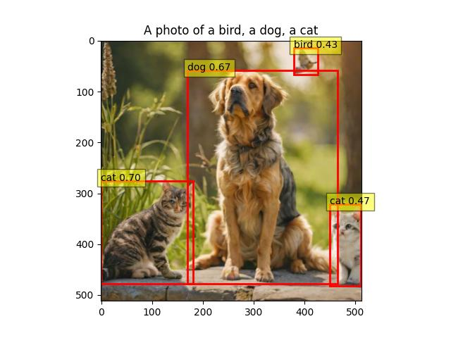

# My DataDreamer Test Project

## Introduction
This repository contains a Python script to generate a dataset using DataDreamer with specific class names such as 'dog', 'cat', and 'bird'. The script is designed for testing the capabilities of DataDreamer in generating and annotating datasets for object detection tasks.

## Installation
To run the script, you need to have Python installed on your system and set up DataDreamer according to its documentation. 

### Setting Up DataDreamer
Refer to the official [DataDreamer GitHub repository](https://github.com/luxonis/datadreamer) for detailed installation and setup instructions.

## Usage
To use the script, simply open `main.py`, edit the values and run the script.

## Contributions
Contributions to this project are welcome. Please ensure that any pull requests or issues are relevant to the project's scope.

## License
This project is licensed under the MIT License. For more details, see the LICENSE file in the repository.
